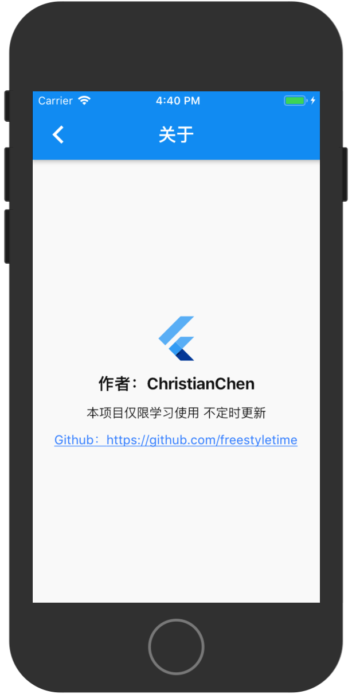

# FlutterNews [](https://github.com/freestyletime/FlutterNews/blob/master/LICENSE) [](https://github.com/freestyletime/FlutterNews/tree/master/apk)

* flutter写的新闻类小项目
* 纯属兴趣使然
* 功能尚不完善
* 不定时更新

## 功能
- 新闻列表页
- 新闻详情页（无链接时提示且不进入，之后会修改）
- 切换日间及夜间主题模式

## 截图
<div>
    
    
    
</div>

## 技术栈
* event_bus
* flutter_webview_plugin

## 下载地址


## 运行项目

获取更多Flutter的信息，请查阅在线[文档](https://flutter.io/)

#### 1. [配置Flutter运行环境](https://flutter.io/setup/)

#### 2. 克隆项目

```sh
$ git clone https://github.com/freestyletime/FlutterNews.git
$ cd FlutterNews/
```

#### 3. 运行APP

```sh
$ flutter run
```

## 参考项目&特别感谢
* [yubo725的项目](https://github.com/yubo725/flutter-osc)

* [oubowu的项目](https://github.com/oubowu/OuNews)

# LICENSE
The MIT License (MIT)

Copyright (c) 2019 freestyletime

Permission is hereby granted, free of charge, to any person obtaining a copy of
this software and associated documentation files (the "Software"), to deal in
the Software without restriction, including without limitation the rights to
use, copy, modify, merge, publish, distribute, sublicense, and/or sell copies of
the Software, and to permit persons to whom the Software is furnished to do so,
subject to the following conditions:

The above copyright notice and this permission notice shall be included in all
copies or substantial portions of the Software.

THE SOFTWARE IS PROVIDED "AS IS", WITHOUT WARRANTY OF ANY KIND, EXPRESS OR
IMPLIED, INCLUDING BUT NOT LIMITED TO THE WARRANTIES OF MERCHANTABILITY, FITNESS
FOR A PARTICULAR PURPOSE AND NONINFRINGEMENT. IN NO EVENT SHALL THE AUTHORS OR
COPYRIGHT HOLDERS BE LIABLE FOR ANY CLAIM, DAMAGES OR OTHER LIABILITY, WHETHER
IN AN ACTION OF CONTRACT, TORT OR OTHERWISE, ARISING FROM, OUT OF OR IN
CONNECTION WITH THE SOFTWARE OR THE USE OR OTHER DEALINGS IN THE SOFTWARE.